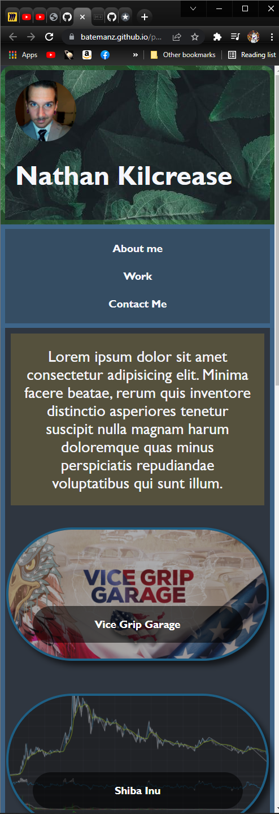
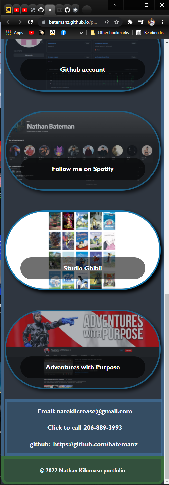

# Professional Portfolio
in this assignement creating a personal portfolio I got a chance to implement flex box on quite a few items allowing me to get a bit more familiar with it and getting a better understanding of it and how it can be helpful.
i was also able to implement some media quirie's
and learned how that can be a helpful tool for resizing the page for smaller screens
also using psuedo css to do things like hover.
if i had more time i would have done a few more psuedo css things like focus and active

### website deployment and usage

Click the link for deployed web app
from there the nav bar at the top allows you to select an item and it will take you directly to where it is on that page
the imgs in the main content are links to deployed websites (I dont have any of my own yet so I chose at random)
clicking each image will take you to the website on a new tab
at the bottom we have a list of contact info 
an email that will open up an email message
a phone number that will start a phone call
and a link to my git hub
these are my actual phone number and email so please do no call/email.

## links

link to git hub repository [Portfolio](https://github.com/batemanz/portfolio.git)

link to deployed website [Nathan-kilcrease-Portfolio](https://batemanz.github.io/portfolio/)

## Images

Screenshots of deployed website

